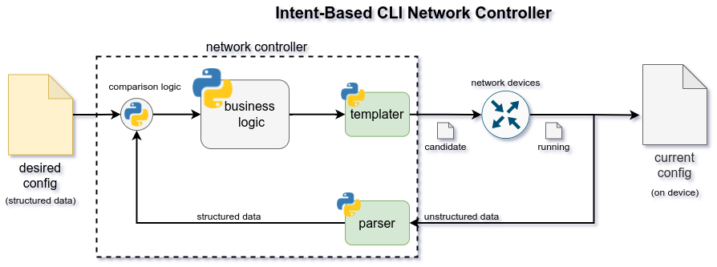

# Programmatic Network Controller
pnc is yet another Programmatic Network Controller.

The idea is to provide an implementation of the abstract controller described [in this blog post](https://matman26.github.io/posts/intent-based-cli-devices-controller).
pnc aims to be:
+ "Frameworkable", able to be generalized for different use cases.
+ Customizable, via meta-type statements.
+ Intent-Driven, via input data models.
+ Extensible, via external Python modules.

